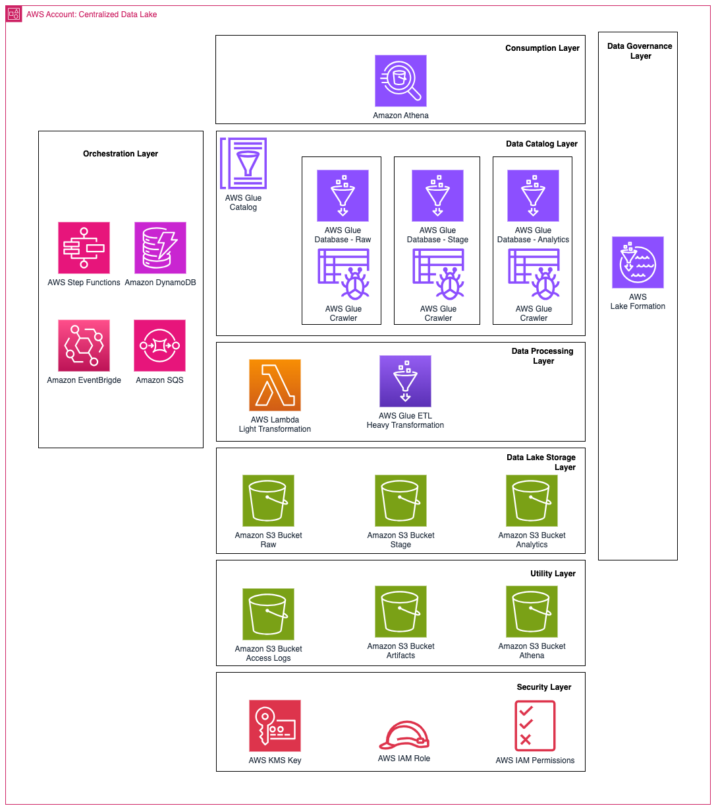
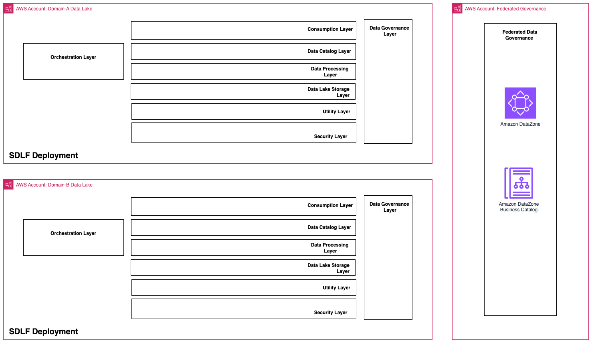

# Architecture

SDLF supports both a centralized datalake deployment pattern and decentralized data domains which could be used as a basis for a [data mesh](https://aws.amazon.com/what-is/data-mesh/) deployment pattern.

## Centralized Data Lake

!!! warning
    We strongly recommend that customers conduct a [Well Architected Review](https://aws.amazon.com/architecture/well-architected/) of their SDLF implementation.

## Data Mesh

The Data Mesh pattern is fundamentally about decentralized data ownership, with data owned by specialized domain teams rather than a centralized data team. This usually means:
- each data domain team has its own dedicated data infrastructure, for production and/or consumption
- each data domain team is able to deploy the tools and infrastructure it needs - a self-serve data platform

A governance layer is federating data assets in a business catalog to ensure compliance against policies and standards, and ease of data sharing across teams.

As such, it can be seen as a collection of data domain-specific datalakes deployed with SDLF. [Amazon SageMaker Data and AI Governance](https://aws.amazon.com/sagemaker/data-ai-governance/) (built on Amazon DataZone) can be used for the governance layer.

!!! warning
    We strongly recommend that customers conduct a [Well Architected Review](https://aws.amazon.com/architecture/well-architected/) of their SDLF implementation.

## Transactional Data Lake

Using [Iceberg](https://docs.aws.amazon.com/prescriptive-guidance/latest/apache-iceberg-on-aws/introduction.html).

!!! warning
    We strongly recommend that customers conduct a [Well Architected Review](https://aws.amazon.com/architecture/well-architected/) of their SDLF implementation.
