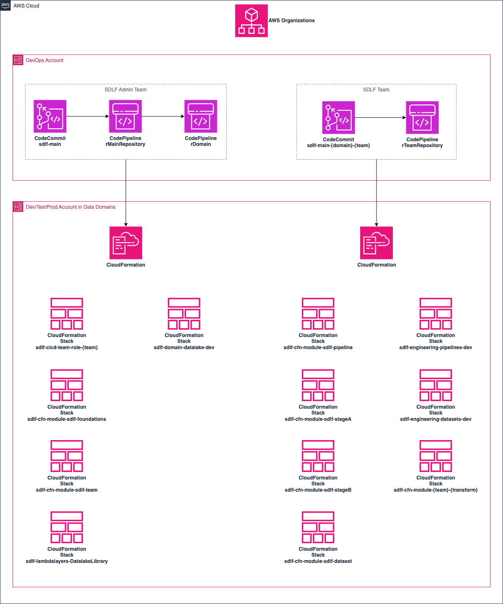
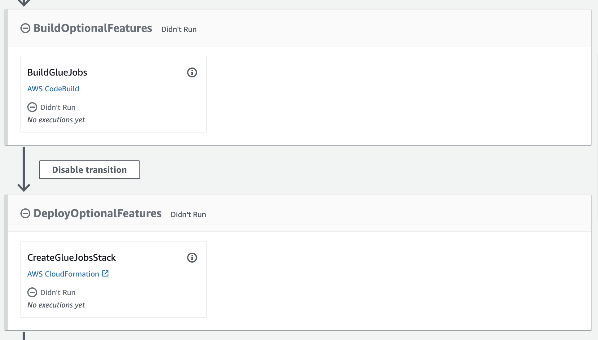

# sdlf-cicd

!!! note
    `sdlf-cicd` is defined in the [sdlf-cicd](https://github.com/awslabs/aws-serverless-data-lake-framework/tree/main/sdlf-cicd) folder of the [SDLF repository](https://github.com/awslabs/aws-serverless-data-lake-framework).

## Infrastructure



`sdlf-cicd` is a special construct that can be used to deploy other SDLF constructs. An end-to-end example is available in the [official SDLF workshop](https://sdlf.workshop.aws/).

## Usage

### Glue Jobs Deployer

Deployment of Glue jobs can be handled by SDLF. This is an optional feature, enabled by setting `pEnableGlueJobDeployer` to `true` when deploying `template-cicd-prerequisites.yaml`. This will add a stage to all teams' pipelines and datasets CodePipeline:



Now teams can add Glue jobs in their repository. Jobs are stored under the `transforms` directory, each in a subdirectory:
```bash
.
└── transforms
    └── legislators
        └── legislators.py
```

Glue jobs are deployed under the name `sdlf-{team}-{directoryname}`. In the case of the example this would be `sdlf-{team}-legislators`. Check [`template-glue-job.yaml` in the `sdlf-cicd` repository](https://github.com/awslabs/aws-serverless-data-lake-framework/blob/2.0.0/sdlf-cicd/template-glue-job.yaml) to know more about the default configuration used.

When this feature is used in conjunction with VPC networking support, a [Glue connection](https://docs.aws.amazon.com/glue/latest/dg/glue-connections.html) is created as well.

### Lambda Layers Builder

Rnabled by setting `pEnableLambdaLayerBuilder` to `true` when deploying `template-cicd-prerequisites.yaml`.

### GitLab

- Create a dedicated user on GitLab. Currently the user must be named: `sdlf`.
- Create an access token with the `sdlf` user. The token name must be named `aws`. Permissions must be `api` and `write_repository`.
- Create [CodeConnections](https://docs.aws.amazon.com/codepipeline/latest/userguide/connections-gitlab-managed.html) for the self-managed GitLab instance

Populate:

- `/SDLF/GitLab/Url` :: secure-string :: GitLab URL **with** trailing `/`
- `/SDLF/GitLab/AccessToken` :: secure-string :: User access token
- `/SDLF/GitLab/CodeConnection` :: string :: CodeConnections ARN

Create CloudFormation role:

```
{
    "Version": "2012-10-17",
    "Statement": [
        {
            "Effect": "Allow",
            "Principal": {
                "Service": "resources.cloudformation.amazonaws.com"
            },
            "Action": "sts:AssumeRole",
			"Condition": {
				"StringEquals": {
					"aws:SourceAccount": "111111111111"
				}
        }
    ]
}
```

Enable `GitLab::Projects::Project` third-party resource type in CloudFormation Registry.

Add configuration (use of ssm-secure is mandatory):

```
{
    "GitLabAccess": {
        "AccessToken": "{{resolve:ssm-secure:/SDLF/GitLab/AccessToken:1}}",
        "Url": "{{resolve:ssm-secure:/SDLF/GitLab/Url:1}}"
    }
}
```

## Interface

There is no external interface.
