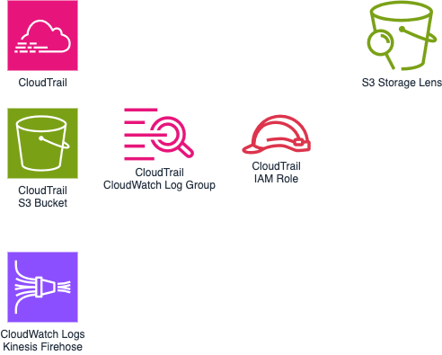

# sdlf-monitoring

!!! note
    `sdlf-monitoring` is defined in the [sdlf-monitoring](https://github.com/awslabs/aws-serverless-data-lake-framework/tree/main/sdlf-monitoring) folder of the [SDLF repository](https://github.com/awslabs/aws-serverless-data-lake-framework).

## Infrastructure



CloudTrail (Auditing) and S3 Storage Lens are resources implemented in the framework. They are deployed once only and are consumed by all systems and users across the lake.

## Usage

### CloudFormation with [sdlf-cicd](cicd.md)

Read the official [SDLF workshop](https://sdlf.workshop.aws/) for an end-to-end deployment example.

```
rProserveMonitoring:
    Type: awslabs::sdlf::monitoring::MODULE
    Properties:
        pPipelineReference: !Ref pPipelineReference
        pCloudtrailEnabled: true
```

## Interface

Interfacing with other modules is done through [SSM Parameters](https://docs.aws.amazon.com/systems-manager/latest/userguide/systems-manager-parameter-store.html). `sdlf-monitoring` publishes the following parameters:

| SSM Parameter                              | Description                                                      | Comment                                      |
| ------------------------------------------ | ---------------------------------------------------------------- | -------------------------------------------- |
| `/SDLF/S3/CloudTrailBucket`                | Name of CloudTrail S3 bucket                                     |                                              |

