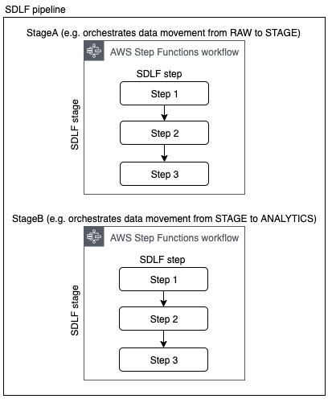
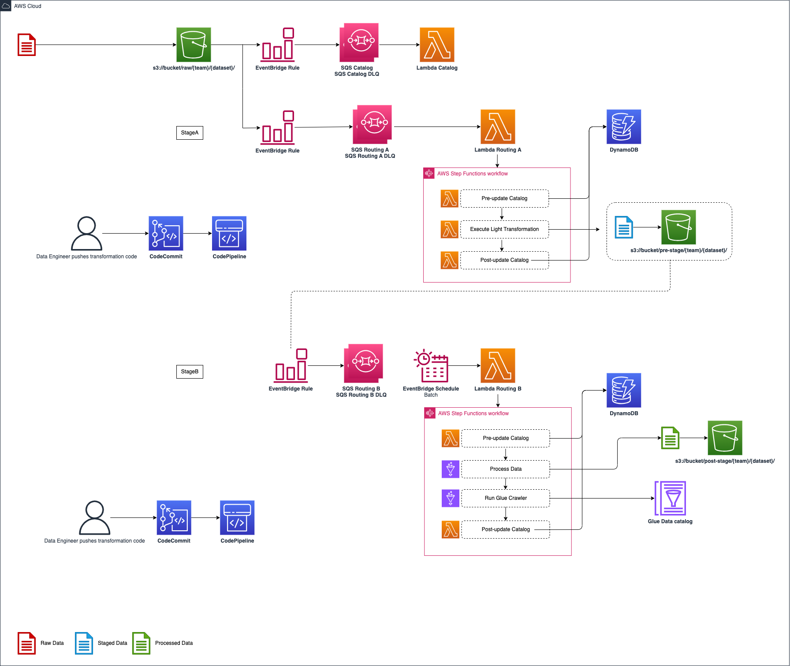

# sdlf-pipeline

!!! note
    `sdlf-pipeline` is defined in the [sdlf-pipeline](https://github.com/awslabs/aws-serverless-data-lake-framework/tree/main/sdlf-pipeline) folder of the [SDLF repository](https://github.com/awslabs/aws-serverless-data-lake-framework).

## Infrastructure



A SDLF pipeline is a logical construct representing an ETL process. A team can implement one or more pipelines depending on their needs.

Each pipeline is divided into stages (i.e. StageA, StageB...), which map to AWS Step Functions. Each Step Functions orchestrates the process of transforming and moving data to different areas within the data lake (e.g. from RAW to STAGING area). There are two main advantages to using Step Functions as an orchestration layer. They are 1) serverless and 2) connected to the entire AWS universe, simplifying integration with other services on the platform. As many stages as necessary can be defined and modified for a pipeline.

Each Step Functions is comprised of one or more steps relating to operations in the orchestration process (e.g. Starting an Analytical Job, Running a crawler...).



An example architecture for a SDLF pipeline is detailed in the diagram above. The entire process is event-driven.

It's important to understand that this is just *one example* used to illustrate the orchestration process within the framework. Each team has full flexibility in terms of the number, order and purpose of the various stages and steps within their pipeline.

1. As a file lands into the RAW bucket under the `{team}/{dataset}` prefix, an S3 Events Notification is created and placed in a queue

2. The first stage (i.e. StageA Step Functions) of the pipeline is triggered. Initial step in the processing is to update the Objects Metadata Catalog DynamoDB table (i.e. File metadata) with details about the landed object (S3 Path, timestamp…), before a light transformation is applied. The code for this light transformation would have previously been pushed into a CodeCommit repository by the data engineer and potentially gone through a code review and testing phase before entering production. The final step is to update the object metadata catalog with the output from the transformation and send the messages to the next SQS queue

3. Every 5 minutes (customizable), an EventBridge rule fires a Lambda which checks if there are messages in the queue sent from the previous stage. If so it triggers the second Step Functions (StageB)

4. This time a heavy transformation is applied on a batch of files. This heavy transformation can be an API call to an Analytical AWS service (Glue Job, Fargate Task, EMR Step, SageMaker Notebook…) and the code is again provided by the data engineer. The state machine waits for the job to reach a SUCCEEDED state before the output is crawled to update the Glue Metadata Catalog (i.e. Tables metadata). A [data quality step](stage-dataquality.md) leveraging Glue Data Quality can also be run.

## Usage

`sdlf-pipeline` is not very interesting by itself. It is intended for inclusion in stages (such as [sdlf-stage-lambda](stage-lambda.md)) for stages to use a common interface (EventBridge as trigger).

### CloudFormation with [sdlf-cicd](cicd.md)

Read the official [SDLF workshop](https://sdlf.workshop.aws/) for an end-to-end deployment example.

```
rPipelineInterface:
    Type: awslabs::sdlf::pipeline::MODULE
    Properties:
        pPipelineReference: !Ref pPipelineReference
        pOrg: !Ref pOrg
        pDomain: !Ref pDomain
        pEnv: !Ref pEnv
        pTeamName: !Ref pTeamName
        pPipelineName: !Ref pPipeline
        pStageName: !Ref pStageName
        pStageEnabled: !Ref pStageEnabled
        pTriggerType: !Ref pTriggerType
        pSchedule: !Ref pSchedule
        pEventPattern: !Ref pEventPattern
        pLambdaRoutingStep: !GetAtt rLambdaRoutingStep.Arn
```

## Interface

Interfacing with other modules is done through [SSM Parameters](https://docs.aws.amazon.com/systems-manager/latest/userguide/systems-manager-parameter-store.html). `sdlf-pipeline` publishes the following parameters:

| SSM Parameter                               | Description                       | Comment                                      |
| ------------------------------------------- | --------------------------------- | -------------------------------------------- |
| `/SDLF/SQS/{team}/{pipeline}{stage}Queue`   | Name of the SQS queue             |                                              |
| `/SDLF/SQS/{team}/{pipeline}{stage}DLQ`     | Name of the SQS dead-letter queue |                                              |
| `/SDLF/Pipelines/{team}/{pipeline}/{stage}` | placeholder                       |                                              |
