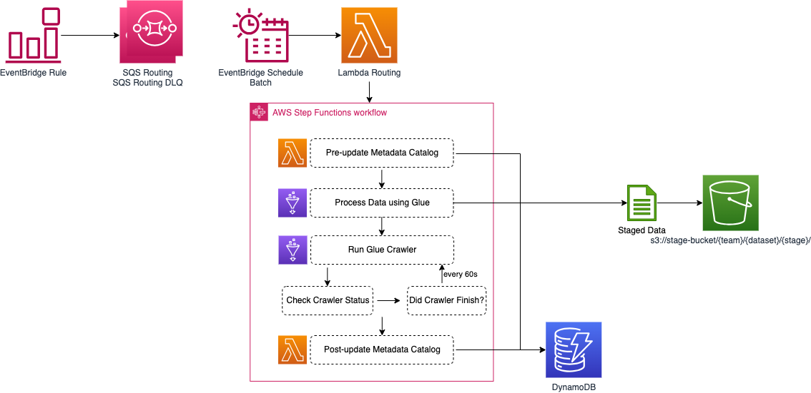

# sdlf-stage-glue (sdlf-stageB)

!!! note
    `sdlf-stage-glue` is defined in the [sdlf-stageB](https://github.com/awslabs/aws-serverless-data-lake-framework/tree/main/sdlf-stageB) folder of the [SDLF repository](https://github.com/awslabs/aws-serverless-data-lake-framework).

## Infrastructure



Run a Glue job.

## Usage

### CloudFormation with [sdlf-cicd](cicd.md)

Read the official [SDLF workshop](https://sdlf.workshop.aws/) for an end-to-end deployment example.

```
rMainB:
    Type: awslabs::sdlf::stageB::MODULE
    Properties:
        pPipelineReference: !Ref pPipelineReference
        pDatasetBucket: "{{resolve:ssm:/SDLF/S3/StageBucket}}"
        pStageName: B
        pPipeline: main
        pTeamName: iot
        pTriggerType: schedule
        pEventPattern: !Sub >-
            {
                "source": ["aws.states"],
                "detail-type": ["Step Functions Execution Status Change"],
                "detail": {
                    "status": ["SUCCEEDED"],
                    "stateMachineArn": ["arn:${AWS::Partition}:states:${AWS::Region}:${AWS::AccountId}:stateMachine:sdlf-iot-main-sm-A"]
                }
            }
        pSchedule: "cron(*/5 * * * ? *)"
        pEnableTracing: false
```

## Interface

Interfacing with other modules is done through [SSM Parameters](https://docs.aws.amazon.com/systems-manager/latest/userguide/systems-manager-parameter-store.html). `sdlf-stage-glue` publishes the following parameters:

| SSM Parameter                                        | Description                                                      | Comment                                      |
| ---------------------------------------------------- | ---------------------------------------------------------------- | -------------------------------------------- |
| `/SDLF/SM/{team}/{pipeline}{stage}SM`                | Name of the DynamoDB used to store mappings to transformation    |                                              |
