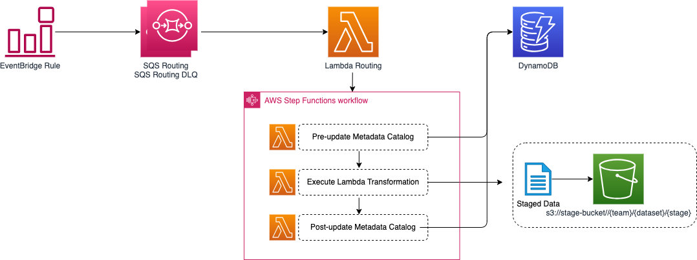

# sdlf-stage-lambda (sdlf-stageA)

!!! note
    `sdlf-stage-lambda` is defined in the [sdlf-stageA](https://github.com/awslabs/aws-serverless-data-lake-framework/tree/main/sdlf-stageA) folder of the [SDLF repository](https://github.com/awslabs/aws-serverless-data-lake-framework).

## Infrastructure



Run a Lambda function.

## Usage

### CloudFormation with [sdlf-cicd](cicd.md)

Read the official [SDLF workshop](https://sdlf.workshop.aws/) for an end-to-end deployment example.

```
rMainA:
    Type: awslabs::sdlf::stageA::MODULE
    Properties:
        pPipelineReference: !Ref pPipelineReference
        pStageName: A
        pPipeline: main
        pTeamName: iot
        pTriggerType: event
        pEventPattern: >-
            {
                "source": ["aws.s3"],
                "detail-type": ["Object Created"],
                "detail": {
                    "bucket": {
                        "name": ["{{resolve:ssm:/SDLF/S3/RawBucket}}"]
                    },
                    "object": {
                        "key": [{ "prefix": "iot/legislators/" }]
                    }
                }
            }
        pEnableTracing: false
```

## Interface

Interfacing with other modules is done through [SSM Parameters](https://docs.aws.amazon.com/systems-manager/latest/userguide/systems-manager-parameter-store.html). `sdlf-stage-lambda` publishes the following parameters:

| SSM Parameter                                        | Description                                                      | Comment                                      |
| ---------------------------------------------------- | ---------------------------------------------------------------- | -------------------------------------------- |
| `/SDLF/Lambda/{team}/{pipeline}{stage}RoutingLambda` | Routing Lambda                                                   |                                              |
| `/SDLF/SM/{team}/{pipeline}{stage}SM`                | Step Functions                                                   |                                              |
