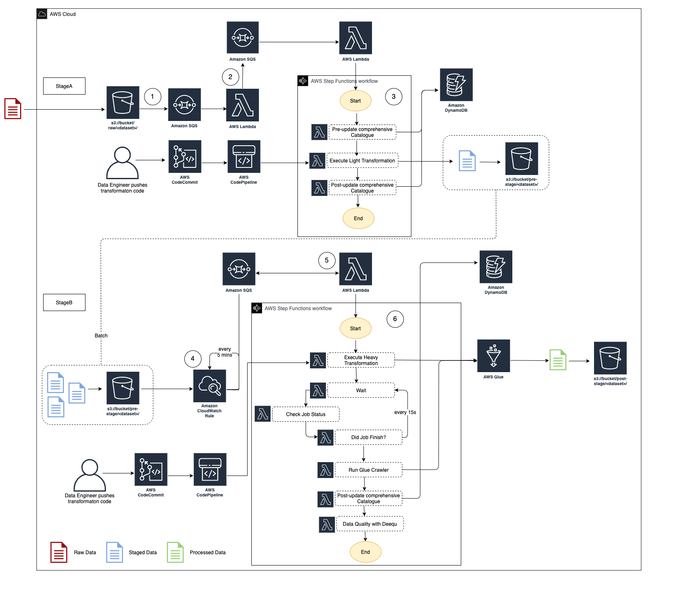

Architecture
=============

An example architecture for a SDLF pipeline is detailed in the diagram above. The entire process is event-driven.

It's important to understand that this is just `one example` used to illustrate the orchestration process within the framework. Each team has full flexibility in terms of the number, order and purpose of the various stages and steps within their pipeline.

1. As a file lands into the RAW bucket under the ``<team>/<dataset>`` prefix, an S3 Events Notification is created and placed in a queue

2. The message is picked up by a Lambda which routes it to the appropriate SDLF team-specific pipeline

3. The first stage (i.e. StageA Step Function) of the pipeline is triggered. Initial step in the processing is to update the Objects Metadata Catalog DynamoDB table (i.e. File metadata) with details about the landed object (S3 Path, timestamp…), before a light transformation is applied. The code for this light transformation would have previously been pushed into a CodeCommit repository by the data engineer and potentially gone through a code review and testing phase before entering production. The final step is to update the object metadata catalog with the output from the transformation and send the messages to the next SQS queue

4. Every 5 minutes (customizable), a CloudWatch Event rule fires a Lambda which checks if there are messages in the queue sent from the previous stage. If so it triggers the second Step Function (StageB)

5. This time a heavy transformation is applied on a batch of files. This heavy transformation can be an API call to an Analytical AWS service (Glue Job, Fargate Task, EMR Step, SageMaker Notebook…) and the code is again provided by the data engineer. The state machine waits for the job to reach a SUCCEEDED state before the output is crawled to update the Glue Metadata Catalog (i.e. Tables metadata). A data quality step leveraging Deequ can also be run