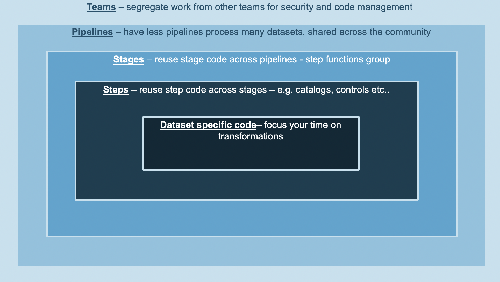

Constructs
===========
The core concepts behind the framework are detailed in this section.

Foundations
***********
Foundational components of the data lake, namely the S3 buckets (Storage), DynamoDB tables (Configuration and metadata catalog), CloudTrail (Auditing) and an optional ELK stack (Monitoring) are the first resources implemented in the framework. They are deployed once only and are consumed by all systems and users across the lake.

.. note:: SDLF foundations are defined and managed from the `sdlf-foundations` repository
.. warning:: The SDLF admin team should be the only one with access to the `sdlf-foundations` repository

Team
*****
A team is a group of individuals that wish to onboard into the data lake. It can be a pizza team of developers or an entire Business Unit such as the marketing or finance department. A team is responsible for their pipelines, datasets and repositories which are unique to the team and completely segregated from others. Teams are also isolated from both an operational and security standpoint through least-privilege IAM policies.

.. note:: SDLF teams are defined and managed from the `sdlf-team` repository
.. warning:: The SDLF admin team should be the only one with access to the `sdlf-team` repository

Pipeline
********
A SDLF pipeline is a logical construct representing an ETL process. A team can implement one or more pipelines depending on their needs.

Each pipeline is divided into stages (i.e. StageA, StageB...), which map to AWS Step Functions. Each Step Function orchestrates the process of transforming and moving data to different areas within the data lake (e.g. from RAW to STAGING area). There are two main advantages to using Step Functions as an orchestration layer. They are 1) serverless and 2) connected to the entire AWS universe, simplifying integration with other services on the platform. As many stages as necessary can be defined and modified for a pipeline. 

Each Step Function is comprised of one or more steps relating to operations in the orchestration process (e.g. Starting an Analytical Job, Running a crawler...). 

.. image:: _static/sdlf-pipeline.png
    :alt: SDLF Pipeline
    :align: center

.. note:: A SDLF team can define and manage their pipelines from the `sdlf-<teamName>-pipeline` repository

.. note:: SDLF teams can share their pipeline definition with others so it can be reused by the community

Dataset
*******
A SDLF dataset is a logical construct referring to a grouping of data. It can be anything from a single table to an entire database with multiple tables for example. However, an overall good practice is to limit the infrastructure deployed to the minimum to avoid unnecessary overhead and cost. It means that in general, the more data is grouped together the better. Abstraction at the transformation code level can then help make distinctions within a given dataset.

Examples of datasets are:

#. A relational database with multiple tables (E.g. Sales DB with orders and customers tables)

#. A group of files from a data source (E.g. XML files from a Telemetry system)

#. A streaming data source (E.g. Kinesis data stream batching files and dumping them into S3)

A dataset must be unique within a team.

.. note:: A SDLF team can define and manage their datasets from the `sdlf-<teamName>-dataset` repository

Transformation
**************
Aforementioned constructs referred to `infrastructure` code. Transformations on the other hand represent the `application` code ran within the steps of a SDLF pipeline. They include instructions to:

#. Make an API call to another service (on or outside the AWS platform)

#. Store dataset and pipeline execution metadata in a catalog

#. Collect logs and store them in ElasticSearch

#. ... any other logic

Once transformations and other application code is pushed to the team respository, it goes through a CodePipeline and can be submitted to testing before it enters production.

.. note:: A SDLF team can define and manage their transformations from the `sdlf-<teamName>-datalakeLibrary` repository

.. note:: Transformations enable decoupling between a SDLF pipeline and a dataset. It means that a single pipeline can process multiple datasets

In a Nutshell
**************
