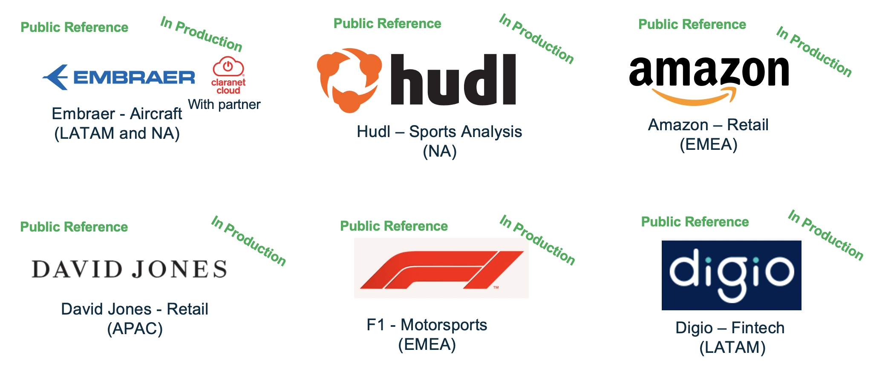

Overview
=========
The Serverless Data Lake Framework (SDLF) is a collection of reusable artifacts aimed at accelerating the delivery of enterprise data lakes on AWS, shortening the deployment time to production from several months to a few weeks. It can be used by AWS teams, partners and customers to implement the foundational structure of a data lake following best practices.

Motivation
***********
A data lake gives your organization agility. It provides a repository where consumers can quickly find the data they need and use it in their business projects. However, building a data lake can be complex; there's a lot to think about beyond the storage of files. For example, how do you catalog the data so you know what you've stored? What ingestion pipelines do you need? How do you manage data quality? How do you keep the code for your transformations under source control? How do you manage development, test and production environments? Building a solution that addresses these use cases can take many weeks and this time can be better spent innovating with data and achieving business goals.

The SDLF is a collection of production-hardened, best practice templates which accelerate your data lake implementation journey on AWS, so that you can focus on use cases that generate value for business. 

Public References
******************

A Working Backwards Approach
*****************************
The below tenets, listed in decreasing order of importance, were used as working backwards guiding principles in the design:

#. **Delivering Value**: Enabling AWS customers to focus on delivering value with their data, not on building the foundations of a data lake

#. **Speed matters**: Accelerating the delivery of enterprise data lakes on AWS from several months to a few weeks

#. **Modularity and Flexibility**:

   - A framework that can easily be tailored to a customer's specific needs (e.g. number and order of the processing steps…)
   - … and allows seamless integration of custom code with any AWS Analytical service (λ, Fargate, SageMaker, Glue, EMR…)

#. **Automated**: Effortless, reproducible and fast deployments with low operations, maintenance and easy administration

#. **Serverless**: Serverless first. Taking advantage of its low cost, enhanced scalability and avoiding networking headaches to customers

Major Features
***************

#. **Traceability and version control**:

   - SDLF is entirely managed through CICD pipelines. At no point is interaction with the AWS console necessary (in fact it's discouraged)

   - Using version control ensures that any change to the data lake is scrutinized before it enters production

#. **Scalability and reproducibility**:

   - Deploying and tearing down a customized, production-grade data lake can be done in minutes and across multiple accounts and environments

   - This is in comparison to a manual approach which would be tedious, slow, prone to errors and unable to scale

#. **Best practices**:

   - Best practices acquired through dozens of implementations in production are enforced in the framework

   - Features such as monitoring (ELK), encryption (KMS), alerting (Cloudwatch alarms), data permissions (Lake Formation) and many more are baked in SDLF so you don't have to reinvent the wheel