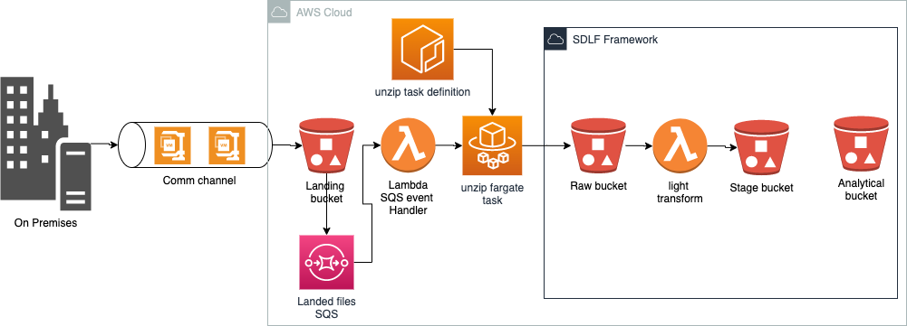

# Problem

Source files for SDLF pipelines could come in a compressed format to optimize bandwidth usage when ingesting from on-premises servers. In that case, decompressing them at the SDLF light transformation stage may not be possible due to time and storage constraints of the lambda service. 

# Solution

Add a layer to the SDLF using an additional landing bucket and Fargate as the processing service to decompress data before writing it to the Raw SDLF bucket.

The default code inside Dockerfile/unzipping_task decompress a compressed file in gzip format. However, it is possible to change the shell code to run any data pre-processing tasks
before reaching the SDLF raw layer. As described in the Problem section, this solution is particularly suitable for pre-processing tasks that may outreach lambda limits on time or storage (e.g. File decompression, File merging)

The architecture of the proposed solution is depicted in the following picture:

 

Note: This solution uses the Serverless Application Model (SAM)

# Requirements

* SDLF deployed in the target account
* CLI access to the target account
* Permissions to create s3 buckets, lambda, Fargate task definitions & SQS
* A docker image to perform the unzipping task stored in ECR

# How to use

1. If you have not installed AWS Cli. Install it: https://docs.aws.amazon.com/cli/latest/userguide/cli-chap-install.html
1. If you have not installed AWS SAM Cli. Install it: https://docs.aws.amazon.com/serverless-application-model/latest/developerguide/serverless-sam-cli-install.html
1. Configure credentials for your SDLF environment account (DEV/TEST/PROD) as explained in this blog entry: https://docs.aws.amazon.com/cli/latest/userguide/cli-configure-profiles.html
1. Create the ECR Docker image by running the "publish_docker.sh" shell script inside the Dockerfile folder using the following syntax:
```
./publish_docker.sh -p <aws_profile> -r <deployment_region> -n <ecr_repository_name>
```
Where:

* **<aws_profile>**: CLI credentials profile for the target account
* **<deployment_region>**: AWS Target region, should match with the SDLF deployment
* **<ecr_repository_name>**: ECR Repository name for storing docker image

1. Modify the parameters corresponding to the target environment (parameters-dev/test/prod.json)

| parameter | description |
| --------- | ------------ |
| pTaskName | Name of the decompression task |
| pS3LandingBucketName | S3 Landing bucket to be created |
| pEcrUnzipDockerImage | Docker Image Ecr URI |
| pFargateTaskCPU | Number of CPU Units used by the task, check template.yaml for allowed values (default: 512) |
| pFargateTaskMemory | Amount of memory used by the task, check template.yaml for allowed values (default: 2048) |
| pSubnetId | Any subnet ID inside the SDLF account VPC |
| pS3LandingPrefix | Prefix of the files that will land into the landing bucket (ex. /datascience/dataset1)
| pS3LandingExt | File extension of the files that will land into the landing bucket (ex. .txt.gz)

1. Run the deployment script using the following syntax: 

```shell
./deploy.sh -p <aws_profile> -r <deployment_region> -e <deployment_env> -c -v
```

Where:
 
* **<deployment_env>**: Target SDLF environment (e.g. dev/test/prod)

# Example

```shell
./deploy.sh -p sdlf_dev -r us-east-1 -e dev -c -v
```

This command will deploy the current artifact into the SDLF account configured in ./aws/credentials file with the "sdlf_dev" alias and it will deploy all the components to the 'us-east-1' region. The target account should match the SDLF Dev account.
 
# Output

After a successful execution of the Cloudformation template this artifact will deploy all the components in the solution architecture above that are inside the AWS cloud and are not part of the SDLF framework. i.e. landing bucket, landed files sqs, sqs lambda handler and an unzip Fargate task that will execute an unzip Fargate task every time that a file with the configured prefix and extension lands to the landing bucket.
