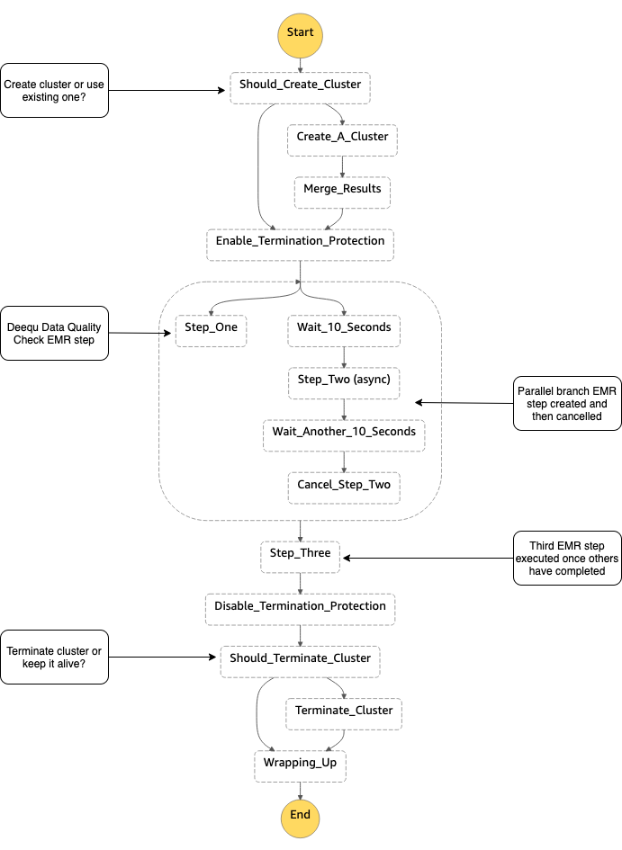

# Tutorial: Building a new pipeline with EMR and Deequ steps into SDLF

The aim of this tutorial is two-fold:
1. Demonstrate how to add a pipeline and a dataset to an existing SDLF deployment
2. Showcase a pipeline example involving multiple EMR steps, including a data quality step using Deequ 

The final output is similar to the step function defined in this [AWS blog](https://aws.amazon.com/blogs/aws/new-using-step-functions-to-orchestrate-amazon-emr-workloads/):



## Pre-requisites
We assume that you have completed the main tutorial deploying the Serverless Data Lake Framework, that is the foundations and at least one team, pipeline and dataset are in place.

## Deployment
We aim to ingest and transform a new dataset named ```clf``` referring to [CloudFront logs](https://github.com/aws-samples/amazon-cloudfront-log-analysis/tree/master/lab1-serveless-cloudfront-log-analysis). The heavy transformation will involve running multiple EMR steps from within the step function.

0. All artifacts mentioned in this tutorial are located in this directory:
    ```bash
    # sdlf-utils repository
    sdlf-utils/pipeline-examples/cloudfront/
    ```

1. First, we create a new stage definition for a pipeline. In this case, we would like the pipeline to keep the same definition for ```stageA``` but to modify ```stageB``` so that the Glue job is replaced with multiple EMR steps. First, navigate to the ```sdlf-stageB``` repository and create a new branch called ```emr```:
    ```bash
    # Run in sdlf-stageB repository
    git checkout -b emr
    ```
    Then replace the CloudFormation ```template.yaml``` and ```./state-machine/stage-b.asl.json``` files in the ```sdlf-stageB``` repository with the ones located in the directory mentioned in the previous step. This new CloudFormation template and State Machine structure define a step function which includes multiple EMR steps. You can run a ```git diff``` to see these changes.
    
    We then push these new changes to the repository:
    ```bash
    git add .
    git commit -m "Creating new StageB definition for EMR"
    git push --set-upstream origin emr
    ```
    Notice how two stageB definitions are now available. One defined through the ```master``` branch and the other through the ```emr``` branch. Each time you wish to modify one or the other, you will need to pull the relevant git branch, modify it and push the changes. A CodePipeline will automatically apply your infrastructure or code updates

2. Now that the ```stageB``` structure has been defined, we can deploy the new pipeline. Navigate to ```sdlf-pipeline``` and modify both the ```pPipelineName``` and ```pStageBBranch``` values to ```emr``` in the ```parameters-$ENV.json``` file. Then push the changes:
    ```bash
    # Run in sdlf-pipeline repository
    ./deploy.sh
    ```
    A new CloudFormation stack will create the necessary infrastructure for this pipeline. Once it reaches the ```CREATE_COMPLETE``` state, you can check in the Step Functions console that a new pipeline is in place with the same StageA definition but with different StageB steps

3. We now turn our attention to creating a new dataset. Navigate to the ```sdlf-dataset``` repository and change the ```pPipelineName``` value to ```emr``` and the ```pDatasetName``` value to ```clf``` in the ```parameters-$ENV.json``` file before saving it. Once the parameters are configured run the below command:
    ```bash
    # Run in sdlf-dataset repository
   ./deploy.sh 
    ```
   A CloudFormation stack for the ```clf``` dataset will be created

4. We must now reference the custom transformations that this new pipeline will apply on the data. Take a look at both the ```clf_light_transform.py``` and ```clf_heavy_transform.py``` files in the ```sdlf-utils``` directory. The light transformation adds a column to incoming CloudFront logs while the heavy transform calls three EMR steps including a Deequ data quality check. Now copy ```clf_light_transform.py``` into ```sdlf-datalakeLibrary/python/datalake_library/transforms/stage_a_transforms``` and
```clf_heavy_transform.py``` into ```sdlf-datalakeLibrary/python/datalake_library/transforms/stage_b_transforms```.

    We then modify the ```dataset_mappings.json``` file to specify the ```dataset``` to ```transforms``` mapping that we wish to apply:
    ```bash
    [
        {
            "name": "legislators",
            "transforms": {
                "stage_a_transform": "light_transform_blueprint",
                "stage_b_transform": "heavy_transform_blueprint"
            }
        },
        ...
        {
            "name": "clf",
            "transforms": {
                "stage_a_transform": "clf_light_transform",
                "stage_b_transform": "clf_heavy_transform"
            }
        }
    ]
    ```

    At last we push these changes:
    ```bash
    # Run in sdlf-datalakeLibrary repository
    git add .
    git commit -m "Created CloudFront logs transforms"
    git push
    ```
    A CodePipeline will update the relevant Lambdas in the ```emr``` pipeline with this code

5. (Optional Step) Optionally, you can add metadata parameters for both this new dataset and the stages of the new pipeline. Open DynamoDB in the console and locate the ```octagon-Dataset-<pEnvironment>``` table. In there, supply additional information such as tags, owner...:
    ```bash
    {
        "name": "engineering-clf",
        "classification": "Green",
        "description": "CloudFront Logs",
        "frequency": "DAILY",
        "max_items_process": {
            "stage_b": 100,
            "stage_c": 100
        },
        "min_items_process": {
            "stage_b": 1,
            "stage_c": 1
        },
        "owner": "AWS",
        "owner_contact": "clf@aws.com",
        "pipeline": "emr",
        "tags": [
            {
            "key": "cost",
            "value": "cloudfront division"
            }
        ],
        "transforms": {
            "stage_a_transform": "clf_light_transform",
            "stage_b_transform": "clf_heavy_transform"
        },
        "type": "TRANSACTIONAL",
        "version": 1
    }
    ```
    Notice how the ```pipeline``` entry maps the ```clf``` dataset to the ```emr``` pipeline while the ```transforms``` entry maps it to the specific custom transform files defined earlier.

    Likewise, we can supply additional metadata in the ```octagon-Pipelines-<pEnvironment>``` table entries:
    ```bash
    {
        "name": "engineering-emr-stage-a",
        "description": "Pipeline to Ingest Data",
        "owner": "Werner Vogels",
        "owner_contact": "w.vogels@",
        "status": "ACTIVE",
        "type": "INGESTION",
        "version": 1
    }
    ```
    and
    ```bash
    {
        "name": "engineering-emr-stage-b",
        "description": "Pipeline to Merge Data",
        "owner": "Werner Vogels",
        "owner_contact": "w.vogels@",
        "status": "ACTIVE",
        "type": "TRANSFORM",
        "version": 1
    }
    ```
    They correspond to the metadata for the ```emr``` pipeline broken down to Pre (i.e. StageA) and Post stage (i.e. StageB)
6. Back in the local directory (```sdlf-utils/pipeline-examples/cloudfront/```), run:
    ```bash
    ./deploy.sh
    ```
    The script will create EMR default roles if they don't already exist in the account, load the EMR and Deequ scripts in the artifacts bucket and start ingesting sample CloudFront logs. 

CloudFront logs will first be processed through the Pre-Stage (i.e. StageA) step function where a column representing the HTTP status outcome is added to each file. Then in the Post-Stage (i.e. StageB) step function, an EMR cluster is created and processes a batch of files through three EMR steps. The first runs a Deequ quality check and outputs results to ```s3://<artifacts-bucket>/engineering/clf/elasticmapreduce/deequ-metrics/metrics-repository/```. The second step is ran in parallel and cancelled after 10 seconds. A last step waits for the previous two to succeed before running a Hive query on the logs to calculate the total number of requests per operating system over a specified time frame. Results are visible in Athena once the Glue crawler step completes.

Note that you can provide an existing EMR cluster Id to the step function instead of creating one. Likewise, you can decide whether to delete the cluster or keep it alive at the end.