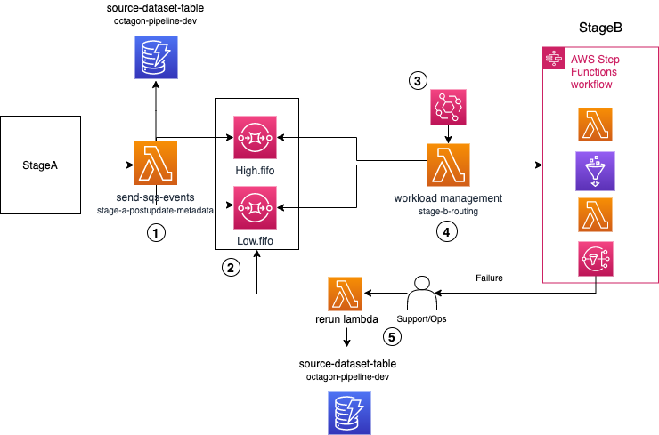

# Tutorial: datalake-workload-management

This readme describes a workload management solution which can be used in data lake pipelines to manage different types of workloads based on source-dataset and priority. It can help to reduce the throttling errors and unnecessary clogging of resource from a dominant source. Since performance and service limits issues are common to most medium to large customers, this solution based on workload management concept can be generalized and reused by other data lake customers as well

## Usecase
In Data Lake projects, there are various different phases ranging from ingestion, foundations and consumption. During the Ingestion phases, a lot of data is ingested to the data lake on s3 from various sources. Each source can have multiple datasets that will be ingested concurrently onto the platform. During one of our usecase implementations, we faced couple of issues with large number of simultaneous step function executions which had multiple steps using glue/lambda resources. 1) The glue job failed with max concurrency which was resolved by adding wait states and increasing the limits 2) Associate KMS key when using KMS key in the glue security configuration where we hit a hard limit on associatekmskey action on CloudWatch log groups. 3) Glue crawler api throttle on start crawler. Furthermore, it become a concern when sources with large number of datasets started taking control of compute resources for a long time and clogging the pipeline. The workload management solution aims to control the flow of step function executions based on priority of source-dataset which will ensure all datasets are processed based on priority.

## Architecture


## Extensibility
The Architecture is extensible by adding more SQS FIFO queues based on varying level of priorities and changing the workload management lambda logic and accomodating new sqs fifo queues.

## Extensibility to SDLF
Refer to the SDLF-WLM-INTEGRATION repository

## Deployment for demo as a stand alone solution
1. We need to set up account profiles in ~/.aws/credentials

2. Run the below command on your local computer terminal to open the help message to see all the execution options
    ```bash
        ./deploy.sh -h
        -h -- Opens up this help message
        -p -- Name of the AWS profile to use for the Account
        -r -- AWS Region to deploy to (e.g. eu-west-1)
        -s -- S3 bucket to store artifact
    ```
3. We start by executing the below command. For demo purpose don’t provide -s and let deploy script create the bucket
    ```bash
        ./deploy.sh -p <aws-profile:default:default> -r <region:default:us-east-1>
    ```
    This will deploy all the nested cloudformation stacks required for the workload management solutions and also fill the DynamoDB with required information for demo purpose

4. Once all the stacks are deployed successfully, check the DDB to confirm if there are 4 records in the table. To start the demo, execute the below command to see the attributes
    ```bash
        ./bootstrap.sh -h
        -h -- Opens up this help message
        -p -- Name of the AWS profile to use for the Account
        -r -- AWS Region to deploy to (e.g. eu-west-1)
        -s -- S3 bucket to store artifact
    ```
5. We start by demo with below command. For demo purpose don’t provide -s and let bootstrap script use the bucket
    ```bash
        ./bootstrap.sh -p <aws-profile:default:default> -r <region:default:us-east-1>
    ```

6. Once the demo is done, run the clean-up script to delete all data, s3 bucket, DDB and all relevant cloudformation stacks. 
    ```bash
        ./cleanup.sh -h
        -h -- Opens up this help message
        -p -- Name of the AWS profile to use for the Account
        -r -- AWS Region to deploy to (e.g. eu-west-1)
        -s -- S3 bucket to store artifact
    ```

7. We start the clean-up with below command. For demo purpose don’t provide -s and let cleanup script use the bucket
    ```bash
        ./cleanup.sh -p <aws-profile:default:default> -r <region:default:us-east-1>
    ```

### Conclusion
The workload management solution can be really helpful when the workload needs to be distributed across various sources based on priority levels, it will ensure that no one source takes control of all available resources and help the customer customize the solution based on their requirement enabling them to scale better
