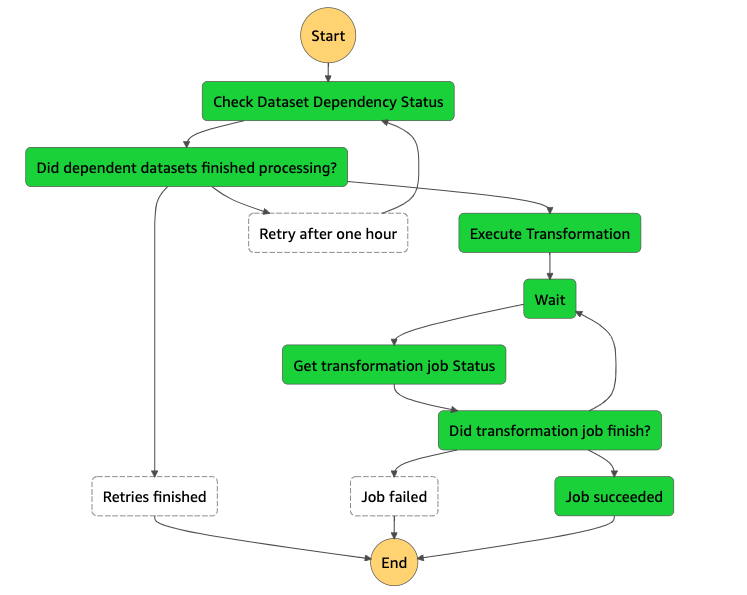

# Tutorial: Datasets Dependency Management

This tutorial details how to chain workflows based on the completion of one or more dependent SDLF pipelines. It aims to provide a way to create a dependency on the execution of a given dataset. The workflow will check whether the pipelines for the datasets defined in the dependency have executed. If the dependency is satisfied, the workflow will proceed, otherwise it will retry based on the specified retry duration and retry count. An example would be to only run a Redshift ETL once upstream SDLF datasets are processed.

## Pre-requisites
We assume that you have completed the main tutorial deploying the Serverless Data Lake Framework, that is the foundations and at least one team, pipeline and dataset are in place.

## Terminology
* Atomic Dataset: A SDLF dataset which does not depend on other datasets for processing
* Aggregate Dataset: A SDLF dataset which depends on two or more Atomic Datasets

## Deployment
1. Use the artifacts in the `stageA` directory to create a SDLF pipeline with one stage. The resulting step function is as follows: 


2. Create the Aggregate Dataset using the template in the `dataset` directory. You can also develop a transform for this dataset that will be executed in the `Execute Transformation` step. Otherwise, use the dummy transformation in the `transforms` directory as a dummy for testing

3. Once the Aggregate Dataset is deployed, update its DynamoDB entry in the `octagon-Dataset-$ENV` table to specify the Atomic Dataset(s) in the dependencies:
```
{
  "dependencies": {
    "dataset1": "engineering-legislators",
    "dataset2": "engineering-politicians",
    ...
  },
  "max_items_process": {
    "stage_b": 100,
    "stage_c": 100
  },
  "min_items_process": {
    "stage_b": 1,
    "stage_c": 1
  },
  "name": "engineering-dependent",
  "pipeline": "aggregate",
  "transforms": {
    "stage_a_transform": "aggregate_dependent_transform",
    "stage_b_transform": "heavy_transform_blueprint"
  },
  "version": 1
}
```
The step function waits for the second stage of all specified Atomic Datasets to finish before executing the submitted transformation. If the conditions are not met, it waits for one hour and retries 2 times by default before abandoning. The retry duration and count can be amended in the stageA and dataset templates, respectively.