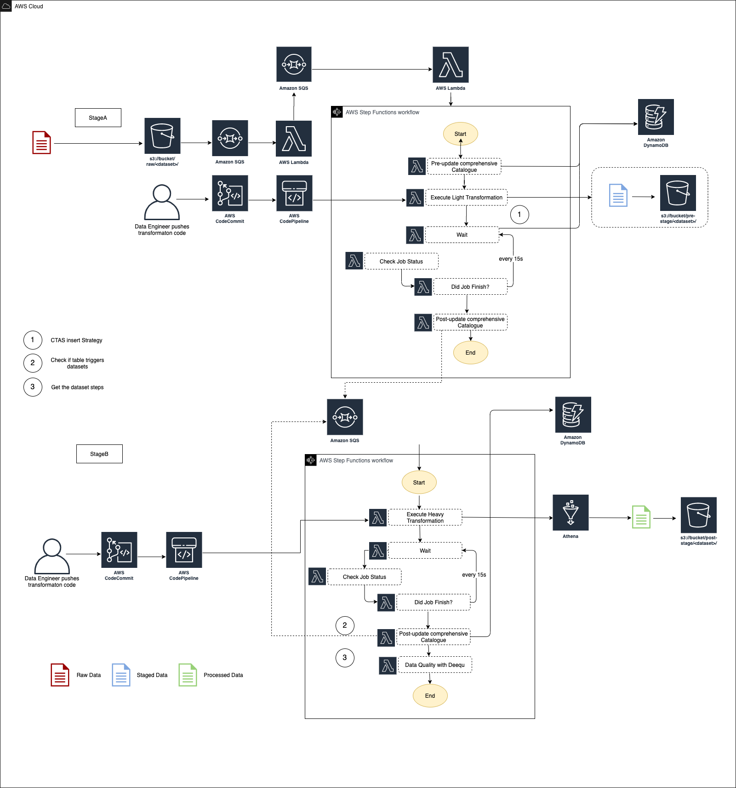
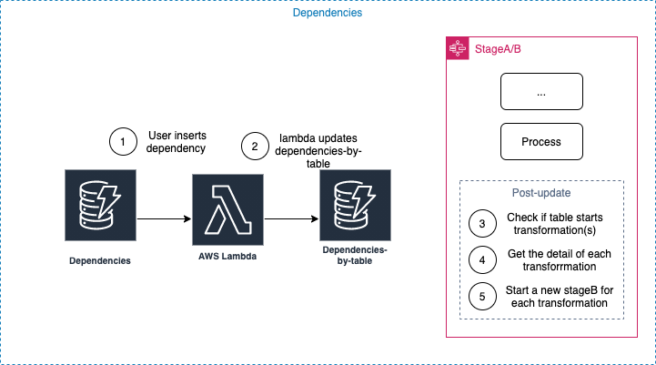

# Event Driven Dataset Dependencies + Athena processing
This repository contains the code to connect the stages A and B based on configurable dependencies.
This solution was created having one thing in mind, to be as easy to use as possible.


This document has two main sections, the **Event driven table dependencies strategy** and **Athena as an ETL** which are explained together to illustrate an end to end pipeline, but they can be deployed independently.


##Installation
This solution is an extension of the SDLF, you need to have an SDLF implementation.
1. Upload the content of the `sdlf-team` folder into its respective repo. 
2. Create a new team (engineering is used for this example)
3. For athena processing, upload the content of the `sdlf-engineering-stageA`,  `sdlf-engineering-stageB`, `sdlf-engineering-pipeline` and `sdlf-engineering-datalakelibrary` folders  into their respective repos. 
4. Create a new pipeline and continue with the normal deployment.


##Modifications made
Some SDLF repos need to be modified to support dependencies.

1. **sdlf-engineering-datalakeLibrary**: 
* Step functions interface to allow naming for easy identification and debugging.
* StageA transformations. Uses CTAS approach to insert data from raw to stage tables controlling the number of files.
* StageB transformations. Execute a series of user defined SQL queries.
2. **sdlf-engineering-team**: 
* permissions to create the DynamoDB tables and athena workgroups.
* Permissions to execute queries with athena.
3. **sdlf-pipeline**
* Workgroup in athena to be used by the stageA/B process.
* DynamoDB dependencies tables and lambda.
4. **sdlf-engineering-stageA**
* State machine checks the progress asynchronously.
* State machine parameters
* Post update checks dependencies and calls stageB
5. **sdlf-engineering-stageB**
* State machine parameters
* Post update checks dependencies and calls stageB

### Architecture

The diagram below illustrates the high-level architecture of the stages used.



**Note**: Since stageA sends directly the message to the stageB SQS the dataset repository is no longer needed. 


##Stage A
The process reads the s3 path of the file to get the database, table and partition (if any) names
For example:
```
'team/database/partitioned_table_name/partition_name=X/file_name'
'team/database/table_name/file_name'
```

* Creates the SQL queries needed to insert from raw to stage and submits the query (using CTAS)
* Checks the progress asynchronously.
* Post update metadata
* Checks  if the processed table starts another transformation (Querying the dependencies DynamoDB tables)
and calls stageB 


**Note**: Raw, stage and analytics databases and tables must exist 


##Stage B
* Reads the SQL queries sent from previous step. (Defined in the dependencies DynamoDB tables) 
* Checks the progress asynchronously.
* Post update metadata
* Checks  if the processed table starts another transformation (Querying the dependencies DynamoDB tables)
and calls stageB 

After each stage the process checks if the processed table should start one or more transformations 


## Dependency Management
###Resources deployed

1. DynamoDB tables 
- dependencies
- dependencies-by-table
2. Lambda Functions
- create-dependencies-by-table

### Architecture

The diagram below illustrates the high-level architecture of the resources used to manage the dependencies:




###Configuration 
To create a new dependency add a new element to the dependencies table using the following structure

| **Parameter**     | **Description**   |
| :-------------: |:-------------|
| **dataset**             | Name of the table to process in the format **database.table**|
| **dependencies**  (List of dictionaries) | Defines the tables that trigger the transformation |
| |**TableName**: Name of the table that triggers the transformation in the format **database.table** |
| |**Usage**: _**append**_ keeps the destination partition files. **_overwrite_** deletes the destination partition files (if any)  |
| |**FieldColumn**: Name of the partition column (used to calculate the target partition) |
| |**DateExpression**: Date format used to parse the date of the FieldColumn uses [strftime](https://docs.python.org/3/library/datetime.html#strftime-and-strptime-format-codes) |
| |**relativedelta_attributes**: Calculates the target date (partition date - relativedelta)  [relativedelta documentation](https://dateutil.readthedocs.io/en/stable/relativedelta.html) |
| **partitionColumn** | Name of the destination partition field |
| **partitionPythonMask**     | Date format used by the destination partition [strftime](https://docs.python.org/3/library/datetime.html#strftime-and-strptime-format-codes)|
| **steps** (List of dictionaries)    | Detail of the transformations |
| | **db**: Athena database where the sql query will be executed |
| | **sql_file**: Sql file to execute, ignored if sql parameter is not empty. It should be stored in the artifacts bucket under the `artifacts/athena_queries/{team}/` directory |
| | **info**: Information about the query. Used for logging and identification |
| | **sql**: SQL statement to execute|
| **date_substitutions** | Substitute the tokens in the **sql** statement with the specified time delta    |
|               |**token**: String to substitute |
|               |**format**: Expected output date format |
|               |**relativedelta_attributes**: Calculates de extraction date (partition received - relativedelta attributes)  [relativedelta documentation](https://dateutil.readthedocs.io/en/stable/relativedelta.html)  |


Example:
The code below show a DynamoDB item
The table to be populated is aws_analytics_dev.destination_table


```
{
 "dataset": "engineering_analytics_dev.destination_table",
 "dependencies": [
  {
   "TableName": "engineering_mysql_dev.customers",
   "FieldColumn": "date",
   "Usage": "overwrite",
   "DateExpression": "%Y%m%d",
   "relativedelta_attributes": {
    "weekday": "SA(1)"
   }
  }
 ],
 "partitionPythonMask": "%Y%m%d",
 "partitionColumn": "date",
 "steps": [
  {
   "sql_file": "",
   "db": "engineering_analytics_dev",
   "info": "SQL to insert into destination_table",
   "sql": "insert into engineering_analytics_dev.destination_table ( SELECT *, '$start_date' FROM TABLE_X where date = '$end_date' "
  }
 ],
 "date_substitutions": [
  {
   "format": "%Y%m%d",
   "relativedelta_attributes": {
    "days": -1
   },
   "token": "$start_date"
  },
  {
   "format": "%Y%m%d",
   "relativedelta_attributes": {
    "days": -5
   },
   "token": "$end_date"
  }
 ]
}
```

# Putting all together 

The next series of steps explain what happens starting with a file arriving to s3.
This example uses the DynamoDB item described above as the only dependency defined. 

1. A new file arrives to the raw bucket:
`engineering/mysql/customers/date=20220120/file_name`

2. StageA starts and creates the queries needed to insert from raw to stage 

```
INSERT INTO engineering_mysql_dev.customer
 SELECT *
 FROM engineering_mysql_raw_dev.customer where $path = 's3:rawbucket/engineering/mysql/customers/date=20220115/file_name'
 ```
Sample sql to show the process. The process uses CTAS to "insert" in a controlled way

3. Once finished, checks if the table `engineering_mysql_dev.customer` triggers more transformations

`engineering_analytics_dev.destination_table ` depends on `engineering_mysql_dev.customer`
It will calculate the destination table partition 
```
"dataset": "engineering_analytics_dev.destination_table",
 "dependencies": [
  {
   "TableName": "engineering_mysql_dev.customers",
   "FieldColumn": "date",
   "Usage": "overwrite",
   "DateExpression": "%Y%m%d",
   "relativedelta_attributes": {
    "weekday": "SA(-1)"
   }
  }
 ],
 "partitionPythonMask": "%Y%m%d",
 "partitionColumn": "new_date",
```
In this case the partition processed from the customer table was `date=20220120`
the destination partition will be `new_date=20220116` 

20220116 = first saturday before 20220120 ("weekday": "SA(-1)")

6. A new message is sent to the StageB SQS with the transformations.
7. StageB replaces the $end_date and $start_date tags on the SQL query using the destination partition date as reference 
```
"steps": [
  {
   "sql_file": "",
   "db": "engineering_analytics_dev",
   "info": "SQL to insert into destination_table",
   "sql": "insert into engineering_analytics_dev.destination_table ( SELECT *, '$start_date' FROM TABLE_X where date = '$end_date' "
  }
 ],
 "date_substitutions": [
  {
   "format": "%Y%m%d",
   "relativedelta_attributes": {
    "days": -1
   },
   "token": "$start_date"
  },
  {
   "format": "%Y%m%d",
   "relativedelta_attributes": {
    "days": -5
   },
   "token": "$end_date"
``` 
Producing the next SQL statement:
```
insert into engineering_analytics_dev.destination_table ( SELECT *, '20220115' FROM TABLE_X where date = '20220111' 
```
20220115 = 20220116 - 1 days

20220111 = 20220116 - 5 days
9. executes the SQL query
10. Once finished, checks if the table processed  triggers more transformations
11. Since no more transformations are defined the StageB finishes. 


# Deep dive:
This section explains in detail some patterns/best practices considered in the implementation

## Dependency Management Detail.
There might be questions on why two tables are used in this approach, this sections explains it. 


Suppose table X is created from table A, this could be stored in a dynamodb table specifying the target table and its dependency. 
```
{
"target": "tableX",
"source": "tableA",
"transformation": "Select a,b,c from ..."
}
```
A secondary index could be created pointing to the source field, and the stage A or B could check at the end of the process in the secondary index if the table just processed triggers a new transformation
This makes sense if we are dealing with one to one dependencies, but that's not always the case.

Let's use the same example, but this time with two tables as dependencies
```
{
"target": "tableX",
"source": ["tableA","tableB"],
"transformation": "Select a,b,c from ..."
}
```
For this scenario secondary indexes get tricky and there would be no choice but to scan the whole table looking for the dependecies. 
This is clearly not efficient, but there's another solution, create a secondary table.

The secondary table is populated reading the changes captured by a dynamoDB Stream from the dependencies table. 
Let's use the previous example.
When a new dependency is created in de dynamoDB dependencies table 
```
{
"target": "tableX",
"source": ["tableA","tableB"],
"transformation": "Select a,b,c from ..."
}
```
Two items will be created in the DynamoDB table **dependencies-by-table**.
```
{
"Source": "tableA"",
"target": "tableX"
},
{
"Source": "tableB"",
"target": "tableX"
}
```
If another dependency is added in the **dependencies** table
```
{
"target": "tableY",
"source": ["tableA"],
"transformation": "Select a,b,c from ..."
}
```
The **dependencies-by-table** items will be updated to the following
```
{
"Source": "tableA"",
"target": ["tableX","tableY"]
},
{
"Source": "tableB"",
"target": "tableX"
}
```

Querying the table **dependencies-by-table** is efficient. 
It can be queried at the end of the stage A or B to check if the table processed triggers one or more transformations.

Note: The process that reads from the DynamoDB stream and updates the items of the  **dependencies-by-table** is implemented in a lambda function called **create-dependencies-by-table** 


##Using Athena as an efficient  ETL ##

Analytics performance, can be impacted by many small files, usually  created as new data is written to the data lake.

Athena is very useful when transforming data using standard SQL, it could be used as a fast and cost-effective
transformation engine, but it’s lacks of mechanisms to control the number of files generated during inserts which can cause s3 throttle problems or make our process inefficient.

Athena can't control the number of files while inserting, but it can be achieved with CTAS.
This process implemented on the StageA takes advantage of the CTAS capabilities and use them to simulate the insert behaviour but controlling the file sizes.


## How is it done? ##

###UNDERSTANDING INSERTS ###
When an insert statement that uses partitions is executed
```
INSERT INTO target_table SELECT normal_fileds, partition_value FROM source_table
```
Athena creates a directory at the table location (if not exists) with the partition name and value.
Under this directory an undefined number of files with the result are created. These files contain all
columns except the partition one which is read from the directory name.
```
s3://awsexamplebucket/target_table/partition_name=partition_value/
```

### UNDERSTANDING CTAS ###
When a table is created using Create table as select (CTAS) it creates a new table in Athena from
the results of a SELECT statement. Athena stores data files created by the CTAS statement in a
specified location in Amazon S3
```
CREATE TABLE ctas_avro_bucketed
WITH (
format = 'AVRO',
external_location = 's3://my_athena_results/ctas_avro_bucketed/',
partitioned_by = ARRAY['nationkey'],
bucketed_by = ARRAY['mktsegment'],
bucket_count = 3)
AS SELECT key1, name1, address1, phone1, acctbal, mktsegment, comment1,
nationkey
FROM table1;
```
In the above example, a table called ctas_avro_bucketed is created, and the results are stored on
the specified location **_s3://my_athena_results/ctas_avro_bucketed/_**

The number of files are specified with bucket_count, this example creates three files

### SIMULATING INSERT USING CREATE TABLE AS SELECT
CTAS is the only way Athena can control the number of files created on a table, the query fails if
specified location path already exists, but, for new partitions we can specify the location of the table
pointing to a table partition subfolder
```
INSERT INTO target_table SELECT normal_fileds, partition_value FROM source_table
```
Creates the folder:
```
s3://awsexamplebucket/target_table/partition_name=partition_value/
```
Under that folder it creates files with the result of the query
```
SELECT normal_fileds FROM source_table
```

The same result can be achieved creating a table with CTAS specifying the partition on the location
```
CREATE TABLE ctas_table
WITH (
format = 'AVRO',
external_location =
's3://awsexamplebucket/target_table/partition_name=partition_value',
partitioned_by = ARRAY['partition_name'],
bucketed_by = ARRAY['normal_fileds'],
bucket_count = 3)
AS SELECT normal_fileds
FROM source_table;
```
Since the files stay even when the table is deleted, we can delete this table and update the target table to include this new partition


### **The whole process can be resumed in three steps:**
1. Create a temporary table on the partition location using CTAS
2. DROP temp table
This will delete the table metadata but not the files
3. Add the new partition on the original table


Bucketed tables control the number of files by storing common rows in the same file. For example,
in a table bucketed by country all rows of a particular country will be stored in the same file, this
can improve filtering and joins but takes more time to execute CTAS queries.

Even if the CTAS query takes longer to execute the cost is similar as the normal INSERT because
Athena is billed on the number of bytes read.

###Failing queries due to exhausted resources?

Check the [Top 10 Performance Tuning Tips for Amazon Athena](https://aws.amazon.com/blogs/big-data/top-10-performance-tuning-tips-for-amazon-athena/)


