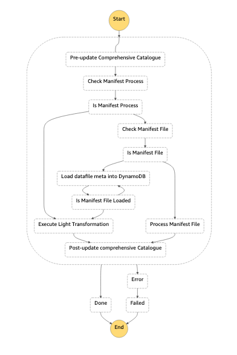
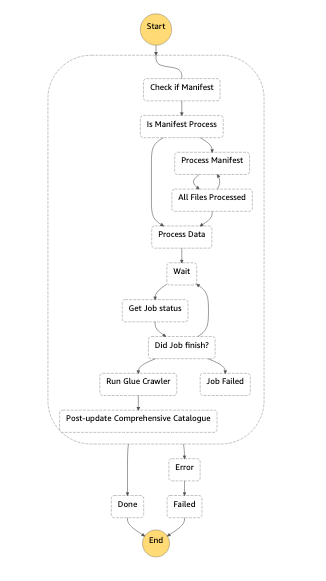
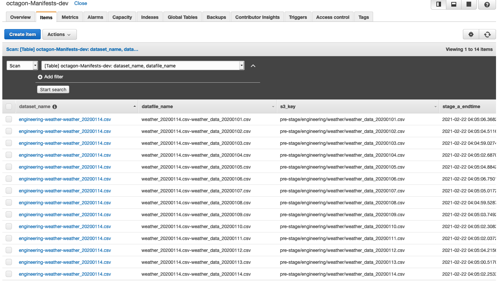

# Tutorial: Manifest Based File Processing

This tutorial shows how a manifest based dataset can be processed using a SDLF pipeline. For us to be able to process a manifest based dataset we will need:-

1. Add a new pipeline to an existing SDLF deployment.
2. Add a new dataset for the above pipeline.


## Pre-requisites
We assume that you have completed the main tutorial deploying the Serverless Data Lake Framework, that is the foundations and at least one team, pipeline and dataset are in place. It also assumes that the engineering team is in place.

### Limitations
1. The manifest file name must be unique with every data load and for every dataset.
2. The datafile name must be unique for each manifest file.

**Manifest Pipeline (Stage A State Machine)**



### Overview Stage A

The data for this pipeline is collected from Open Data on AWS and can be found [here](https://registry.opendata.aws/noaa-ghcn/). In this stage both the manifest file and the data file are processed. The contents of the manifest file are a part of the key for the DynamoDB control table. The processing metadata of the data file is stored in the DynamoDB control table against the said keys. The DynamoDB control table is used to control the flow of the processing in both Stage A and Stage B of the pipeline. If the dataset is manifest driven, then only the mainfest file is sent to the next stage.

1. ```stage-a-preupdate-metadata``` : Pre update the comprehensive catalogue for the incoming file. 

2. ```stage-a-manifestprocess-check``` : Checks whether the dataset being processed is manifest enabled or not. Returns True if the dataset is manifest enabled.

3. ```stage-a-manifestfile-check``` : Checks whether the current file being processed is the manifest file. Checks against the regex pattern which is set during the dataset registration.

4. ```stage-a-process-manifestfile``` : If the file being processed is a manifest file then it is read and loaded into the DynamoDB control table. The keys for the control table are :
    * ```team-dataset-manifestfilename```
    * ```manifestfilename-datafilename``` 

5. ```stage-a-loaddatafile-metadata``` : This step first checks whether the manifest file has been loaded or not. If the manifest file has not been loaded, this step sleeps for 5 mins and checks again if the manifest has been loaded or not. This keeps repeating every 5 minutes until the manifest file has been loaded or until the manifest threshold has been breached whichever is earlier. Once the process finds the entry for the manifest file, it updates the metadata for the datafile and marks the Stage A status as STARTED for the the current file.

6. ```stage-a-process-object``` : In this step the light tranform is executed and the control table is updated with Stage A status as PROCESSING.

7. ```stage-a-postupdate-metadata``` : In this step the comprehensive catalogue is updated and Stage A status is marked as "COMPLETED" if the light transform was successful else it is marked as "FAILED".

**Manifest Pipeline (Stage B State Machine)**



### Overview Stage B

In this stage the manifest file is processed to identify the datafiles that need to be processed. The datafile names obtained from the manifest filename are queried against the DynamoDB control table and if these files have been processed successfully in Stage A then they are sent to the heavy tranformation to processed further.

1. ```stage-b-checkmanifestprocess``` : In this step it is checked if the dataset being processed is manifest driven. Returns True if it is manifest enabled.

2. ```stage-b-processmanifest``` : In this step the manifest file is processed to get the keys for the DynamoDB control table. These keys are used to query the control table to check if the files have been processed in Stage A. If the files have not been processed yet or are being processed then this step waits for 5 minutes and checks again. This step repeats evry 5 minutes until all the files have been loaded or the datafile timeout threshold has been breached, whichever is earlier. If there are failures for any files in Stage A then this steps marks the dataset as "FAILED" for Stage B status and fails the pipeline. If all the files have been processed then this step marks the Stage B status as "STARTED" and moves to the hevy transform.

3. ```stage-b-process-data``` : This step calls the heavy transform, this case the glue job. This step creates the actual s3 prefixes that needs to be processed by the heavy tranform from the DynamoDB control table. Once the job has been triggered, the Stage B status is set to "PROCESSING".

4. ```stage-b-postupdate-metadata``` : In this step the Stage B status is marked as "COMPLETED" if the glue job was successful else it is marked as "FAILED". This step also updates the comprehensive catalogue. 


### Deployment Steps

1. All artifacts mentioned in this tutorial are located in this directory :
    ```bash
    # sdlf-utils repository
    sdlf-utils/pipeline-examples/manifests/
    ```

2. Copy the following directories with their content to the root location:-
    * stageA
    * stageB
    * pipeline
    * dataset

3. The name of the directories that need to be created in the step below can begin with the following:-
    >sdlf-team-pipeline-dirname

    In this case we will use "sdlf-engineering-mani"

4. Execute the following command in the manifests directory:
    ```bash
    ### Copy Manifest Folders to root location
    cp -R stageA ../../../sdlf-engineering-mani-stageA/
    cp -R stageB ../../../sdlf-engineering-mani-stageB/
    cp -R dataset ../../../sdlf-engineering-mani-dataset/
    cp -R pipeline ../../../sdlf-engineering-manifest-pipeline/
    ```
5. Create the codecommit repositories for Stage A , Stage B and Pipeline 
    >Replace ${REGION} and ${PROFILE} values
    ```bash 
    ### Create the Stage A Repository
    ### Replace ${REGION} and ${PROFILE} values
    cd ../../../sdlf-engineering-mani-stageA
    aws codecommit create-repository --region ${REGION} --profile ${PROFILE} --repository-name sdlf-engineering-mani-stageA
    git init
    git add .
    git commit -m "Initial Commit"
    git remote add origin https://git-codecommit.${REGION}.amazonaws.com/v1/repos/sdlf-engineering-mani-stageA
    git push --set-upstream origin master
    git checkout -b test
    git push --set-upstream origin test
    git checkout -b dev
    git push --set-upstream origin dev

    ### Create the Stage B Repository
    ### Replace ${REGION} and ${PROFILE} values
    cd ../sdlf-engineering-mani-stageB
    aws codecommit create-repository --region ${REGION} --profile ${PROFILE} --repository-name sdlf-engineering-mani-stageB
    git init
    git add .
    git commit -m "Initial Commit"
    git remote add origin https://git-codecommit.${REGION}.amazonaws.com/v1/repos/sdlf-engineering-mani-stageB
    git push --set-upstream origin master
    git checkout -b test
    git push --set-upstream origin test
    git checkout -b dev
    git push --set-upstream origin dev

    ### Create the Pipeline Repository
    ### Replace ${REGION} and ${PROFILE} values    
    cd ../sdlf-engineering-manifest-pipeline
    aws codecommit create-repository --region ${REGION} --profile ${PROFILE} --repository-name sdlf-engineering-manifest-pipeline
    git init
    git add .
    git commit -m "Initial Commit"
    git remote add origin https://git-codecommit.${PROFILE}.amazonaws.com/v1/repos/sdlf-engineering-manifest-pipeline
    git push --set-upstream origin master
    git checkout -b test
    git push --set-upstream origin test
    git checkout -b dev
    git push --set-upstream origin dev
    ```

6. Take a look at the ```parameters-dev.json``` in the ```sdlf-engineering-mani-dataset``` folder: 
    ```bash
    cd ../sdlf-engineering-mani-dataset
    ```
    ```bash
    [
        {
            "ParameterKey": "pTeamName",
            "ParameterValue": "engineering"
        },
        {
            "ParameterKey": "pPipelineName",
            "ParameterValue": "manifest"
        },
        {
            "ParameterKey": "pDatasetName",
            "ParameterValue": "weather"
        },
        {
            "ParameterKey": "pManifestFlag",
            "ParameterValue": "True"
        },
        {
            "ParameterKey": "pManifestFileName",
            "ParameterValue": "weather"
        },
        {
            "ParameterKey": "pManifestFileExtension",
            "ParameterValue": "csv"
        },
        {
            "ParameterKey": "pRegexPattern",
            "ParameterValue": "weather_[0-9]{8}.csv"
        },
        {
            "ParameterKey": "pManifestFileTimeout",
            "ParameterValue": "10"
        },
        {
            "ParameterKey": "pDataFileTimeout",
            "ParameterValue": "10"
        }
    ]
    ```

The **pRegexPattern** tells the pipeline the manifest file it should be looking for. The regex pattern should be python regex for the pipeline to be able to match the incoming manifest file name.

7. Create the dataset repository
    >Replace ${REGION} and ${PROFILE} values

    ```bash
    ### Create the Stage B Repository
    ### Replace ${REGION} and ${PROFILE} values
    aws codecommit create-repository --region ${REGION} --profile ${PROFILE} --repository-name sdlf-engineering-mani-dataset
    git init
    git add .
    git commit -m "Initial Commit"
    git remote add origin https://git-codecommit.${REGION}.amazonaws.com/v1/repos/sdlf-engineering-mani-dataset
    git push --set-upstream origin master
    git checkout -b test
    git push --set-upstream origin test
    git checkout -b dev
    git push --set-upstream origin dev
    ```
8. Copy the light tranform, heavy transform and the dataset mappings.
    ```bash
    cd ../sdlf-engineering-datalakeLibrary/python/datalake_library/transforms
    cp ../../../../sdlf-utils/pipeline-examples/manifests/dataset_mappings.json .
    cp ../../../../sdlf-utils/pipeline-examples/manifests/transforms/light_transform_manifest.py ./stage_a_transforms/
    cp ../../../../sdlf-utils/pipeline-examples/manifests/transforms/heavy_transform_manifest.py ./stage_b_transforms/
    ```
9. Take a look at the dataset_mappings.json file 
    ```bash
    [
    {
        "name": "weather",
        "transforms": {
            "stage_a_transform": "light_transform_manifest",
            "stage_b_transform": "heavy_transform_manifest"
        }
    }
    ]
    ```
    This maps the light and heavy transform that you just copied over from the utils folder.
10. Push the changes in datalake library so that the transforms can be mapped.
    ```bash
    cd ../../../
    git add .
    git commit -m "Map light and heavy transforms"
    git push
    ```

11. Once the deployment completes, move to the following directory
    ```bash
    # sdlf-utils repository
    sdlf-utils/pipeline-examples/manifests/
    ```
    Deploy the glue job and send the data files to test the pipeline.

    ```bash
    ./deploy.sh
    ```
    This will execute a cloud formation template to deploy the glue job. 

12. Once both Stage A and Stage statemachines have completed exection, you can check the DynamoDB control table for the files that were processed.


