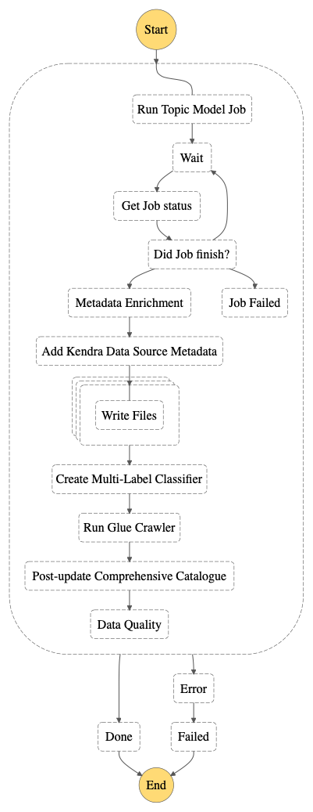

# Tutorial: Leveraging AWS Comprehend to Handle Unstructured Data

The aim of this tutorial is to:
1. Demonstrate how to add a new pipeline and dataset to an existing SDLF deployment
2. Showcase using Amazon Comprehend Topic Modeling and Document Classifiers to handle unstructured data

**ML Pipeline (Topic Model Step Function)**



### Overview
The data for this pipeline is collected from the 'metadata.csv' releases on the CORD-19 Public Dataset. For more details about the data please look [here](https://www.semanticscholar.org/cord19)

Research csv files will first be processed through the Pre-Stage (i.e. StageA) step function where we will remove certain columns (including publish_date, author, source_url, etc.). Also, each abstract text from each row will be written to an individual .txt file in the s3 pre-stage bucket so the Topic Model can process it. Then in Post-Stage (i.e. StageB) step function:

1. ```ml_heavy_transform```: Run a Topic Model Job on Amazon Comprehend and wait for output to be created (specifying ‘ONE DOC PER FILE’)

2. ```stage-b-compile-data```: Extract output and associate each document with a topic number and associated terms

3. ```stage-b-kendra-metadata``` & ```stage-b-write-files```: Using a Map state in AWS Step Functions, invoke Lambdas to dynamically handle a variable size of data and write individual metadata json files for each document (used in Kendra search).
    - This step is predominantly for Amazon Kendra use. If Kendra is not a part of your solution feel free to remove this step entirely

4. ```stage-b-create-classifier```: Start a Multi-Label Document Classifier to begin training using the Topic Model data we found (Note: we will not wait for this process to complete and will continue on in the pipeline. The algorithm must be trained before using it in the new data pipeline)

5. ```stage-b-crawl-data```: Crawl the output data to retrieve any relevant metadata

6. ```stage-b-postupdate-metadata```: Add metadata to DynamoDB

7. Start a Deequ Data Quality Step Function to handle quality checks on the data

## Pre-requisites
We assume that you have completed the main tutorial deploying the Serverless Data Lake Framework, that is the foundations and at least one team, pipeline and dataset are in place.

## Deployment
We aim to ingest and transform one new dataset (```research```) and pipeline (```ml```). The pipeline will train a topic modeling job to find topics based on the input data. The heavy transformation will involve running one or more Comprehend steps from within the step function.

1. All artifacts mentioned in this tutorial are located in this directory:
    ```bash
    # sdlf-utils repository
    sdlf-utils/pipeline-examples/topic-modelling/
    ```
2. First, we update the permissions boundary in the ```sdlf-team/nested-stacks/template-iam.yaml``` template so that Comprehend can carry out certain actions. Replace the ```template-iam.yaml``` with the one located in this directory and push the changes by running:

    ```bash
    # Run in sdlf-team repository
    git add . 
    git commit -a -m "Updating permission boundary with Comprehend actions"
    git push
    ./deploy.sh
    ```

3. While some pip libraries come built-in to SDLF (e.g boto3), we need to add others to help us process our unstructured text data and its outputs. To do so, we add the following libraries by adding new directories in the ```sdlf-pipLibrary``` repositories with their respective requirements.txt:
    - LangDetect – To detect the language the abstract was written in. Comprehend’s Multi-Label Classifier requires one language to better train its algorithm and run accurate classification jobs. For this demo, we filtered the abstracts to be in English.
    - JSONLines – To iterate through and handle JSON Lines text format returned as output from Comprehend’s Multi-Label Classifier

    Copy the LangDetect and JSONLines directories from ```sdlf-utils/pipLibraries/``` to ```sdlf-pipLibrary/``` repository. Then push the changes:

    ```bash
    # Run in sdlf-team repository
    git add . 
    git commit -a -m "Add LangDetect and JSONLines Python Libraries"
    ./deploy.sh
    ```

### Creating 'ml' Pipeline
1. We first update the template.yaml in StageA to add Pandas and LangDetect Python libraries to the process Lambda step so we can leverage these tools. Navigate to the ```sdlf-stageA``` repository and replace the CloudFormation ```template.yaml``` and ```./state-machine/stage-a.asl.json``` files in the ```sdlf-stageA``` repository with the ones located in the local directory. You can run a ```git diff``` to see these changes. Push these changes by running:
    ```bash
    git commit -a -m "Add Pandas and LangDetect to StageA process lambda"
    git push
    ```

2. Now, we create a new stage definition for stageB for the pipeline. Navigate to the ```sdlf-stageB``` repository and create a new branch called ```ml```:
    ```bash
    # Run in sdlf-stageB repository
    git checkout -b ml
    ```
    Then replace the CloudFormation ```template.yaml``` and ```./state-machine/stage-b.asl.json``` files in the ```sdlf-stageB``` repository with the ones located in the local directory. This new CloudFormation template and State Machine structure define a step function which includes multiple ML steps. Moreover, add the additional lambdas from the local directory to ```sdlf-stageB``` repository and replace the postupdate lambda.
    
    You can run a ```git diff``` to see these changes. We then push them to the repository:
    ```bash
    git add .
    git commit -m "Creating new StageB definition"
    git push --set-upstream origin ml
    ```
    Notice how two stageB definitions are now available. One defined through the ```master``` branch and the other through the ```ml``` branch. Each time you wish to modify one or the other, you will need to pull the relevant git branch, modify it and push the changes. A CodePipeline will automatically apply your infrastructure or code updates

3. Now that the ```stageB``` structure has been defined, we can deploy the new pipeline. Navigate to ```sdlf-pipeline``` and modify both the ```pPipelineName``` and ```pStageBBranch``` values to ```ml``` in the ```parameters-$ENV.json``` file. Then push the changes:
    ```bash
    # Run in sdlf-pipeline repository
    ./deploy.sh
    ```
    A new CloudFormation stack will create the necessary infrastructure for this pipeline. Once it reaches the ```CREATE_COMPLETE``` state, you can check in the Step Functions console that a new pipeline is in place with the same StageA definition but with different StageB steps

4. We now turn our attention to creating a new dataset. Navigate to the ```sdlf-dataset``` repository and change the ```pPipelineName``` value to ```ml``` and the ```pDatasetName``` value to ```research``` in the ```parameters-$ENV.json``` file before saving it. Once the parameters are configured run the below command:
    ```bash
    # Run in sdlf-dataset repository
   ./deploy.sh 
    ```
   A CloudFormation stack for the ```research``` dataset will be created

5. We must now reference the custom transformations that this new pipeline will apply on the data. Take a look at both the ```ml_light_transform.py``` and ```ml_heavy_transform.py``` files in the ```transforms/``` local directory. The light transformation extracts relevant columns from the csv and writes each document text to a new txt file. The heavy transform calls a Topic Modelling step in Amazon Comprehend. Now copy ```ml_light_transform.py``` into ```sdlf-datalakeLibrary/python/datalake_library/transforms/stage_a_transforms``` and ```ml_heavy_transform.py``` into ```sdlf-datalakeLibrary/python/datalake_library/transforms/stage_b_transforms```.

    We then modify the ```dataset_mappings.json``` file to specify the ```dataset``` to ```transforms``` mapping that we wish to apply:
    ```bash
    [
        {
            "name": "legislators",
            "transforms": {
                "stage_a_transform": "light_transform_blueprint",
                "stage_b_transform": "heavy_transform_blueprint"
            }
        },
        ...
        {
            "name": "research",
            "transforms": {
                "stage_a_transform": "ml_light_transform",
                "stage_b_transform": "ml_heavy_transform"
            }
        }
    ]
    ```

    At last we push these changes:
    ```bash
    # Run in sdlf-datalakeLibrary repository
    git add .
    git commit -m "Created ML Topic Model Transforms"
    git push
    ```
    A CodePipeline will update the relevant Lambdas in the ```ml``` pipeline with this code

6. (Optional Step) Optionally, you can add metadata parameters for both this new dataset and the stages of the new pipeline. Open DynamoDB in the console and locate the ```octagon-Dataset-<pEnvironment>``` table. In there, supply additional information such as tags, owner...:
    ```bash
    {
        "name": "engineering-research",
        "classification": "Green",
        "description": "Comprehend Topic Model",
        "frequency": "DAILY",
        "max_items_process": {
            "stage_b": 100,
            "stage_c": 100
        },
        "min_items_process": {
            "stage_b": 1,
            "stage_c": 1
        },
        "owner": "AWS",
        "owner_contact": "research@aws.com",
        "pipeline": "ml",
        "tags": [
            {
            "key": "cost",
            "value": "machine learning division"
            }
        ],
        "transforms": {
            "stage_a_transform": "ml_light_transform",
            "stage_b_transform": "ml_heavy_transform"
        },
        "type": "TRANSACTIONAL",
        "version": 1
    }
    ```
    Notice how the ```pipeline``` entry maps the ```research``` dataset to the ```ml``` pipeline while the ```transforms``` entry maps it to the specific custom transform files defined earlier.

    Likewise, we can supply additional metadata in the ```octagon-Pipelines-<pEnvironment>``` table entries:
    ```bash
    {
        "name": "engineering-ml-stage-a",
        "description": "Pipeline to Ingest Data",
        "owner": "Werner Vogels",
        "owner_contact": "w.vogels@",
        "status": "ACTIVE",
        "type": "INGESTION",
        "version": 1
    }
    ```
    and
    ```bash
    {
        "name": "engineering-ml-stage-b",
        "description": "Pipeline to Run Machine Learning Algorithms on Data",
        "owner": "Werner Vogels",
        "status": "ACTIVE",
        "type": "TRANSFORM",
        "version": 1
    }
    ```
    They correspond to the metadata for the ```ml``` pipeline broken down to Pre (i.e. StageA) and Post stage (i.e. StageB)

#### Test Pipelines and Customize
To test this new pipeline, copy the files locate in the data directory into the RAW S3 bucket under the relevant ```<team>/<dataset>``` prefix. The step function should get triggered and the topic modelling job run.

You can continue to customize these pipelines in a variety of ways, including:

- Adding/Removing Step Function states in stageA and stageB for your pipeline
- Leveraging other Comprehend ML tools, such as Comprehend Medical or Sentiment Analysis
- Working with other varieties of unstructured text data, including social media posts, webpages, news articles, etc.

#### (Optional) Adding Kendra Enterprise Search

The following optional step enables Kendra Search for handling the output. Kendra provides highly-accurate enterprise search using machine learning to deliver results quickly and easily.

To set up Amazon Kendra, create an index for all your documents. Deciding between which version depends on the count of the number of documents you hope to store and the capacity of queries you need for your data. 

Next, after running the ```ml``` pipeline, you can add data sources pointing towards the location of your text files. The metadata json files can be used as facets for each document to help best query the index and filter for different criteria. Choose “run on demand” for the frequency of data sync jobs, as we will now call Kendra data sync as part of our stageB pipeline.

After creating you index and data sources, you can go into the postupdate stage in the ```ml``` branch of stageB and uncomment the datasync code for Amazon Kendra. Now whenever we run our pipeline we will also sync our new data and metadata to our Kendra index:

    ```bash
        # Only uncomment if using Kendra and index and data source ALREADY created
        # Data Sync Job
        # kendra_client = boto3.client('kendra')
        # response = kendra_client.start_data_source_sync_job(
        #         Id='ENTER_DATASOURCE_ID',
        #         IndexId='ENTER_INDEX_ID''
        #         )
    ```

More information about Amazon Kendra can be found here: [Amazon Kendra](https://aws.amazon.com/kendra/)
