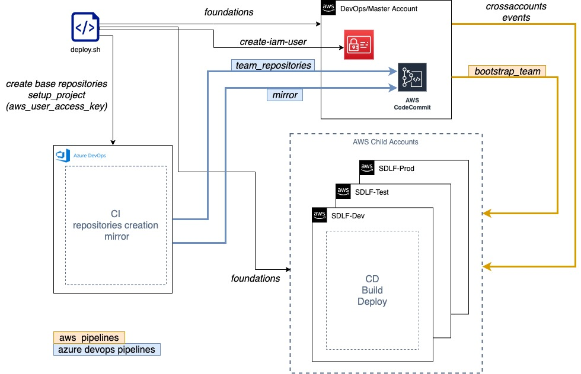

# Serverless Data Lake Framework (SDLF)

## Azure DevOps



NOTE: For convenience, the Azure DevOps words will be replaced by ADO.

1. The foundations stacks are still created from the deploy script
2. A [service connection](https://docs.microsoft.com/en-us/azure/devops/pipelines/library/service-endpoints?view=azure-devops&tabs=yaml) using the [AWS vsts connector](https://aws.amazon.com/vsts/) is used to manage the repositories creation on AWS. This role or user configured inside the service connection must have at least the next policy:
```
{
    "Version": "2012-10-17",
    "Statement": [
        {
            "Effect": "Allow",
            "Action": [
              "codecommit:*"
            ],
            "Resource": "arn:aws:codecommit:*:*:sdlf-*"
        }
    ]
}
```
3. setup_project: modifies the ADO configuration for the deployment script
4. The base repositories are created in AWS empty.
5. The base repositories are created and populated in ADO. So are the pipelines which in the Mirror stage, will use the service connection mentioned in 2.
6. The team creation is now an ADO pipeline responsability therefore the PAT token is stored as a variable in the sdlf-team pipeline with the porpose to create the team repositories in ADO and AWS 

NOTE: From now on, the script **bootstrap_team.sh** from the **sdlf-team** repository will not create any team repository.

## Prerequisites:

1. [Azure-cli](https://docs.microsoft.com/en-us/cli/azure/install-azure-cli) and an authenticated user with the capability to create repositories, password access tokens and pipelines.
2. [Azure Personal access tokens](https://docs.microsoft.com/en-us/azure/devops/organizations/accounts/use-personal-access-tokens-to-authenticate?view=azure-devops&tabs=preview-page#create-a-pat) 
A PAT with the name **sdlf-aztoken** is necessary in order to allow the sdlf-team pipeline to create the team repositories in ADO. The [scopes](https://docs.microsoft.com/en-us/azure/devops/integrate/get-started/authentication/oauth?view=azure-devops#scopes) of the token should be:
    - Agent Pools: Read (vso.agentpools)
    - Build: Read & execute (vso.build_execute)
    - Code: Read, write, & manage (vso.code_manage)
    - Project and Team: Read (vso.project)
*NOTE: The expiration time for the PAT should be according to the company policy and it has to be renewed to avoid the pipelines disruption*

3. JQ: If you're using the linux subsystem, you can install it with:
   
    - sudo apt install -y jq
    
    Otherwise, you can install it from the github page: https://stedolan.github.io/jq/download/
4. [AWS-cli](https://aws.amazon.com/cli/)
5. [AWS Toolkit for Azure DevOps](https://aws.amazon.com/vsts/) Used in the service-connection. This connection **must** be configured previous to deployment and **has** to be configured as mentioned in bullet number 2 from the main section of this document
6. SED: If you're using the linux subsystem, you can install it with:
   
   - sudo apt install -y sed
    
   or if you're using MacOS:    
   
    - brew install gnu-sed

## Setup before deploy

1. Go to the thirdparty-scms/ado directory
2. Modify the file parameters.json according to your Azure DevOps company configuration:
   
   - **organization**: The name of your organization
   - **project**: The name of the project where all the resources will be created
   - **repository-prefix**: The prefix of the repositories for the SDLF project
   - **service-connection-name**: The name of the service connection that will use the AWS Toolkit
     to allow the interaction with the CodeCommit repositories. 
   - **sdlf-aztoken**: The PAT string created in the Azure DevOps console (like shown on Prerequisites, bullet number 2)  

    Note: All the parameters are mandatory and can not be empty

3. Execute the foundations *deploy.sh* script with the option extra option **-x ado** from the root folder according to the SDLF installation instructions
